# Advanced Lane Finding Project


---

### **Goals**

The goals of this project are to annotate the given video to show the lane region, the curvature of the lane and the offset of the vehicle from the lane's centerline.

#### **Image Processing Steps**

In order to accomplish this task, first the camera needs to be calibrated, which is a one-time process.  Then for each image, the following steps must be carried out.

1. Undistort the image using the calculated calibration coefficients and matrix.

2. Apply thresholding techniques using gradient and color transforms to create a binary image.

3. Apply a perspective transform in order to rectify the binary image giving one a bird's-eye view.

4. Curve fit the lane lines, determine the lane curvature, and calculate the car's position within the lane.

5. Determine the lane boundary and paint the lane region green.  Then unwarp/transform the painted image image back to its original perspective. 

6. Add radius of curvature and lane offset information to the image.


#### **Line Object**

The final pice of the puzzle is to implement a Line class which allows the code to track various properties of each lane line from one frame to the next.  This way one can build some additional intelligence into the lane detection algorithm by dropping bad detections and averaging good detections in order to provide a smoother performance of the lane line annotations. 

---

### Camera Calibration

Before the images from the video can be used effectively, the camera must first be calibrated in order to account for distortion to the picture caused by the lens.  Lense distortion varies from lens to lens and tends to be most significant near the edges of the image and in images taken at oblique angles.

In order to calibrate the camera, we were given 20 images taken by the camera of a chessboard object.  Using OpenCV's `findChessboardCorners()` method, the corners of the squares in a grayscale version of each image are automatically detected.

The actual object points can easily be determined since we know what a chessboard looks like and can easily find its corners.  By mapping the detected image corner points to these known object points,  the camera matrix and the distortion coefficients can be calculated using the library's `calibrateCamera()` method.  By storing the camera matrix and distortion coefficients, any image taken by the camera can readily be undistorted using the `undistort()` method.

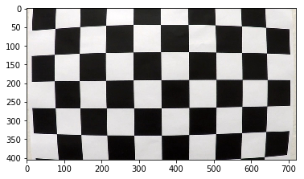 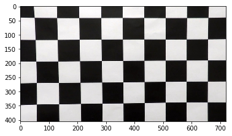

### Image Processing Pipeline

#### 1. Undistort the Image

The first step in the image processing pipeline is to use the camera matrix and distortion coefficients calculated during the camera calibration.  Before one can accurately detect lane lines, it is important to ensure that the lane lines are not distorted.  

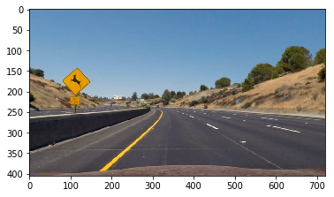

#### 2. Create a Binary Image

I separately used  gradient transformation and color space transformation in order to create thresholded binary images. 

The Sobel gradient operator is used to find regions of the image where the pixel brightnesses change rapidly.  This is useful for detecting edges in an image and is well-suited for finding lane lines in an image.  Unfortunately, in addition to finding lane lines, it also finds many other edges in the image which we wish to ignore.  By selecting appropriate threshold values, a binary image (or mask) can be created that will accurately reflect the lane lines.  Specifically, the Sobel X gradient operator was used in this project.

In addition to using the Sobel operator for thresholding, the image was converted to various color spaces as certain channels within these spaces proved to be very useful for detecting lane lines in a variety of driving conditions.  Specifically use was made of the red and blue channels in RGB color space, the value channel in HLS color  space, the saturation channel in HSV color spaceand the V-channel in CIELuv color space in order to create the thresholded binary images below. 


##### RGB Color Space

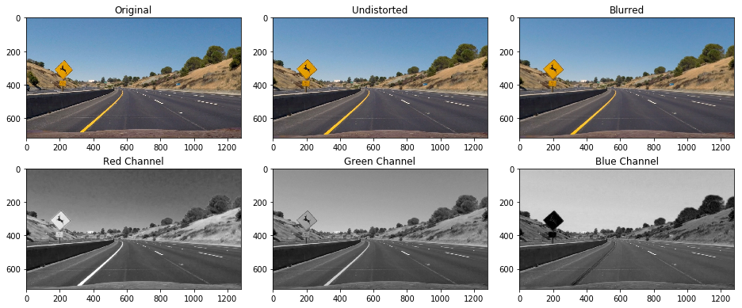

##### HLS Color Space

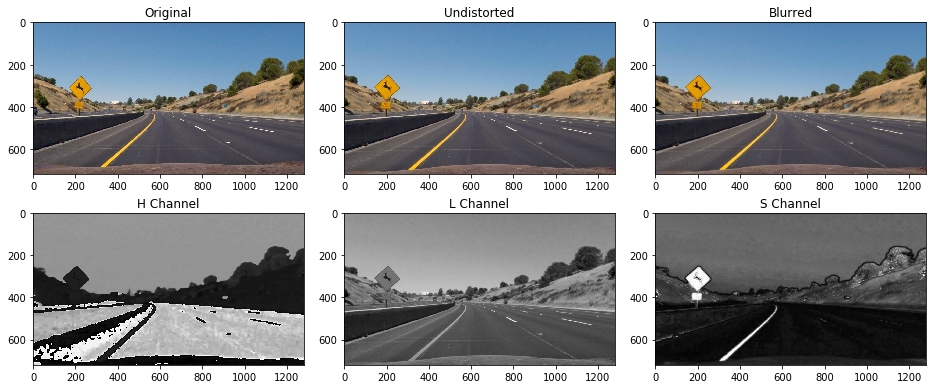

##### HSV Color Space

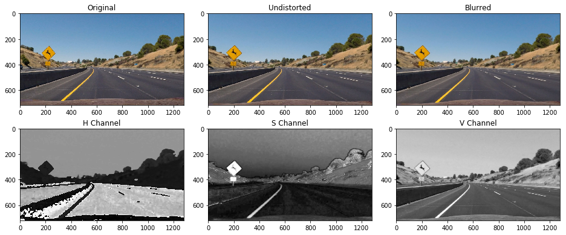

##### CIELuv Color Space

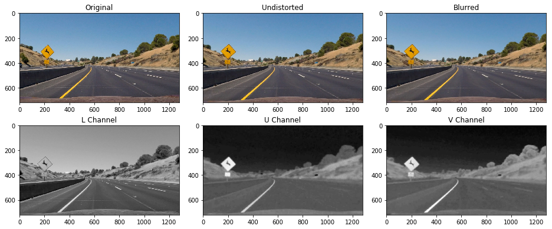

Binary images were created using thresholding for the channels mentioned above.  Then the binary images were combined in a manner that produced good, solid lane lines on the final binary image. 

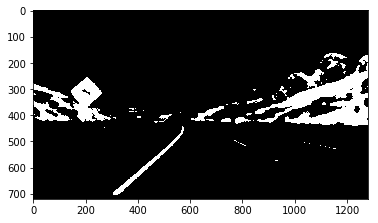 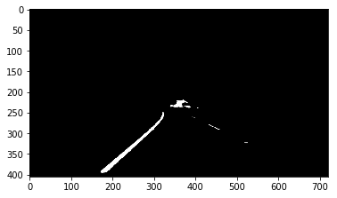

Owing to the fact that we known that the lane line will only appear in a certain region of the image, a region mask was created to remove (turn off) any activated pixels that do not fall within the region.  The resulting image is one in which the lane lines are accurately represented.

#### 3. Transform to Bird's-Eye View

The code for my perspective transform includes a function called `warp()`

```python
def warp(img):
    img_size = (img.shape[1], img.shape[0])
    src = np.float32([[545, 480],[735, 480],
                      [310, 640],[990, 640]])
    dst = np.float32([[310, 350], [1075, 350], 
                     [310, 640],[1075, 640]])
    M = cv2.getPerspectiveTransform(src, dst)
    warped = cv2.warpPerspective(img, M, img_size)
    return warped
```

The source points were found by using an image of a stright piece of road and outputting an enlarged version of the image.  Four points (two well-spaced points on each lane line) were read off the image and these were sued as the source points.  For the destination points, I transformed those four points into a rectangle.  Using the `warp()` function above, the image is transformed into a bird's-eye view.  The destination points were then calibrated by tweaking them slightly until the transformed image show lane lines that were straight, vertical and parallel.  The following source and destination point were found to produce good results on multiple images of straight lane lines and so were hard-coded into the `warp()` function.

|  Source  | Destination |
| :------: | :---------: |
| 545, 480 |  310, 350   |
| 735, 480 |  1075, 350  |
| 310, 640 |  310, 640   |
| 990, 640 |  1075, 640  |

I verified that my perspective transform was working as expected by drawing the `src` and `dst` points onto a test image and its warped counterpart to verify that the lines appear parallel in the warped image.

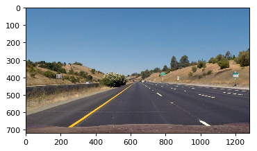 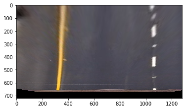

Using this as the baseline, for transforming the image to a bird's-eye view, the transformation was applied to the binary image.

#### 4. Curve Fit the Lane Lines

In order to curve fit the lane lines, the first step is to process the perspective-transformed binary image in order to detect which pixels make up the lane lines.  Once we know these pixels, a polynomial can be curve-fit to the points.  For this purpose, a 2nd degree polynomial is used.

For my first iteration, I used the sliding windows approach to get an initial curve fit for the lane lines.  Once this curve fit is known, subsequent processing of images will look for lane pixels in the image in a tight region around where the lane line was found to be in the previous image.  This is done on the basis that lane line will not vary much between two successive images.  Also this approach of searching around a known region is much faster thanusing the sliding windows method.  However, if at any point the location of the lane line is lost, then I reverted to the sliding windows method until a curve fit for the lane lines could be re-established.  

The sliding windows method for lane pixel detection, however, has some shortfalls.  One significant shortfall is that when lane lines run off the side of the image (as they do in the case of very sharp bends in the road), then the sliding window get stuck at the edge of the image - a result of requiring a minimum number of detected pixels in order to relocate the window.  For this reason, I decided to use the convolution method for lane finding instead.  This method does not rely on a minimum number of pixels being detected and so is more robust in the case of windy roads.

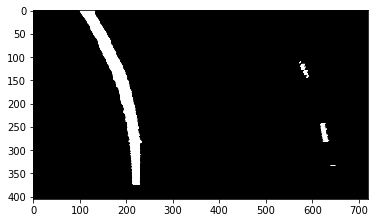 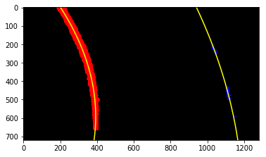

#### 5. Draw the Lane Region

For the purpose of annotating the lane regions, I created a blank (black) image the same dimensions as the bird's-eye binary image.  Then using the points generated from the curve fits and OpenCV's `fillPoly()` method, the green lane region was drawn.  This image was the unwarped back to its original perspective by once again using the `warpPerspective()` method - only this time the source and destination points were reversed.

The unwarped drawing of the lane region is then suitable to merge with the original, undistorted image.

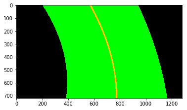 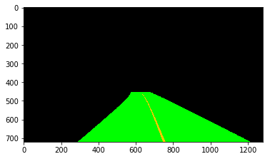

#### 6. Add Calculated Information to Image

The final step of the processing pipeline is the adding of text to the image.  Specifically, the information showing the radius of curvature of the lane and the offset of the vehicle from the center of the lane was added to the top left corner on the image.  For the purpose of calculating the lane curvature, the radius of curvature for each lane was determined from the coefficients found in the curve-fitting process then these were averaged in order to find the radius of curvature of the lane.  The offset of the vehicle within the lane was determined by comparing the centerpoint of the lane lines with the center of the image.

For the purpose of converting from pixels to meters, the following values were used:

```python
ym_per_pix = 30/720  # meters per pixel in y dimension
xm_per_pix = 3.7/700 # meters per pixel in x dimension
```

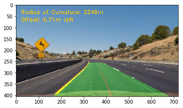

------

### Implementing the Line Class

In order to build some intelligence into the handling of each line detection, the following Line class was implemented.  The allows for the persistence of various properties of each line between successive frames.  Tracking these properties allows one to build intelligence that rejects line detections that appear to be bad and averages good detections in order to provide a smooth, consistent performance. 


```python
class Line():

    def __init__(self):
        # was the line detected in the last iteration?
        self.detected = False  
        # x values of the last n fits of the line
        self.recent_xfitted = [] 
        #average x values of the fitted line over the last n iterations
        self.bestx = None     
        #polynomial coefficients averaged over the last n iterations
        self.best_fit = None  
        #polynomial coefficients for the most recent fit
        self.current_fit = []  
        #radius of curvature of the line in some units
        self.curvature = None 
        #distance in meters of vehicle center from the line
        self.offset = None 
        #difference in fit coefficients between last and new fits
        self.diffs = np.array([0,0,0], dtype='float') 
        #x values for detected line pixels
        self.allx = None  
        #y values for detected line pixels
        self.ally = None  
        #number of frames since last acceptable lane line detection
        self.misses = 0
        
    def add_new_line_fit(self, fit):
        self.current_fit.append(fit)
        if len(self.current_fit) > 5: self.current_fit.pop(0)  #prune the queue 
            
        # find the best fit
        if len(self.current_fit) > 0: 
            self.best_fit = np.average(self.current_fit, axis=0) 
            self.detected = True
        else:
            self.detected = False
```

The idea is that a line object is created for each of the two lines and this allow for the persistence or various parameters that can be used to track the line detections and, if possible, return a best fit to be used for the image.  Each time one of the lines is detected, it is added to a list of recent detections called the `current_fit` list IF it first passes a few sanity checks.  The best fit for each lane line is determined by averaging any recent fits that have been stored.  If the list is empty, then the `best_fit` variable gets set to `None` and the lane region is not drawn on the image until a valid recent detection is added to the list.

---

### Project Video

<video src="project_video_result.mp4"></video>

### Challenge Video

<video src="challenge_video_output.mp4"></video>

---

### Discussion

The pipeline worked very well on the project video.  For the case of the challenge video, the results were mostly satisfactory, but the algorithm does struggle at times when there are shadows on the road or in conditions of very bright sunlight light.  The algorithm further had difficulties in the harder challenge video in the case of a windy road with sharp curves.  If I had more time I would have spent attention on the Line class in order to make the line handling more robust so that it can recover in the event of missing detection in some frames.

